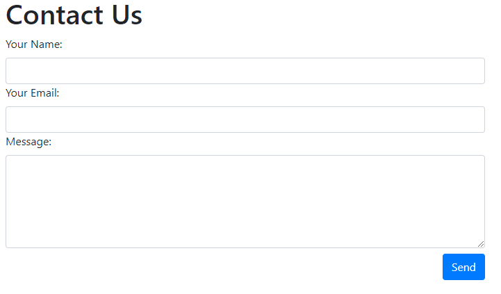

# Git for Teams - Classwork Assignment

### Assignment
* Before you begin this assignment read all directions and decide how to break up the work
* Create an HTML, JS, and CSS file
* Create a contact form in your HTML file with fields for name, email, and message similar to `contactExample.png`
* When the form is submitted save the information into an object using object literal notation, the property names should align with the form field names
* Alert the user that the form has been submitted and print each value of the form submission object in a formatted string
* Add styling - the styling does not have to match the example image, get creative

### Branching
* Create a branch called `[YOUR-NAME]-branch`
* Checkout your new branch
* Complete assignment in your individual branches

### Pull Request
* Open the repo in GitHub
* Create a pull request
* Review the changes made

### Merging
* Approve the pull request opened
* Merge the pull request
* View the completed merge in GitHub from the code tab of the master branch
* Pull the changes from your team members merge into your branch locally using `git pull origin master`

### Ways to avoid merge conflicts
* communicate with your team
* `git pull origin master` before making any changes on your branch and after each push
* push local changes from your branch often (smaller pull request are better)